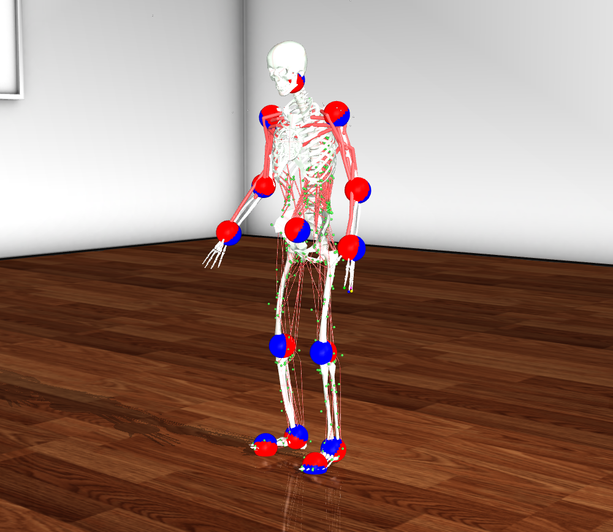
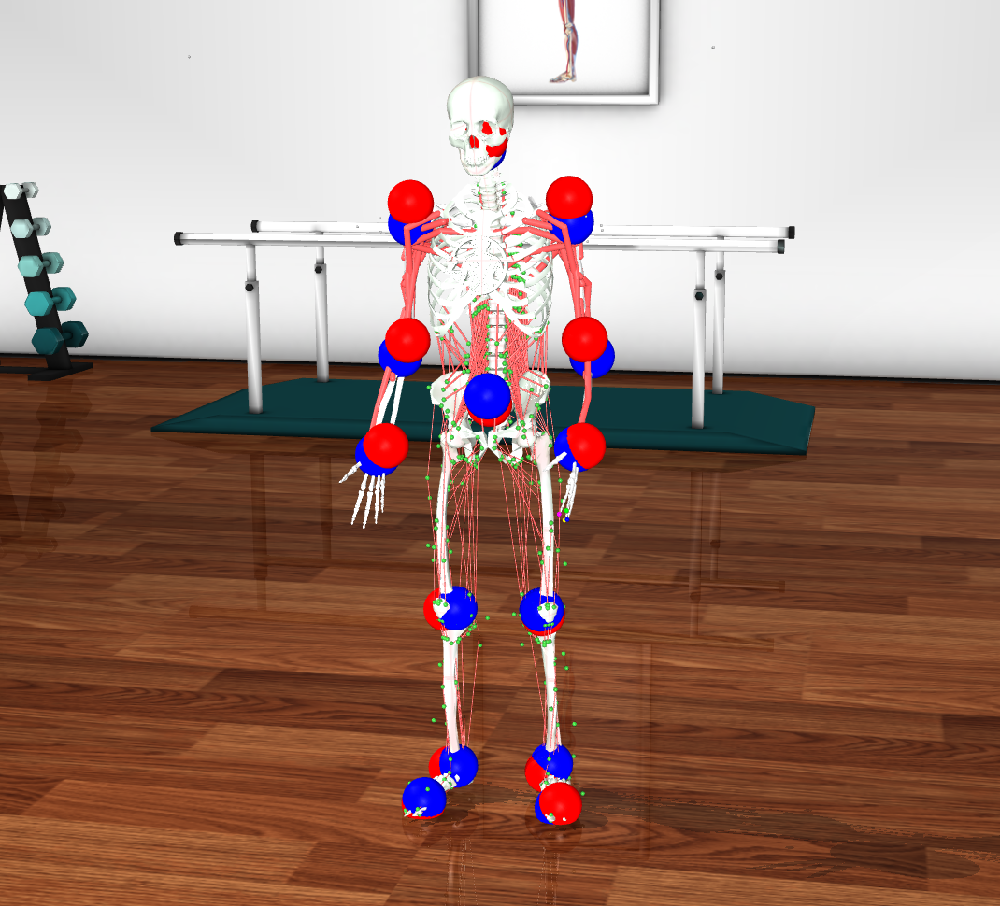
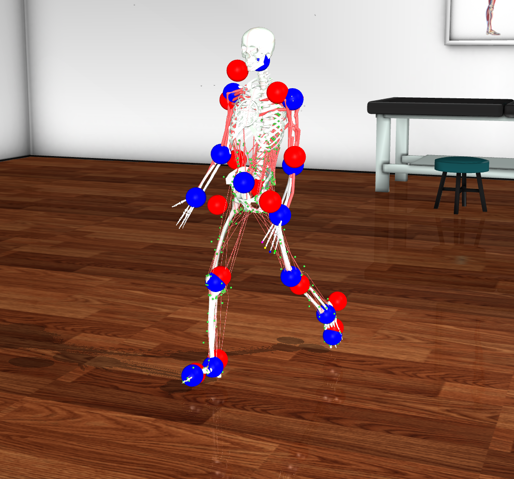
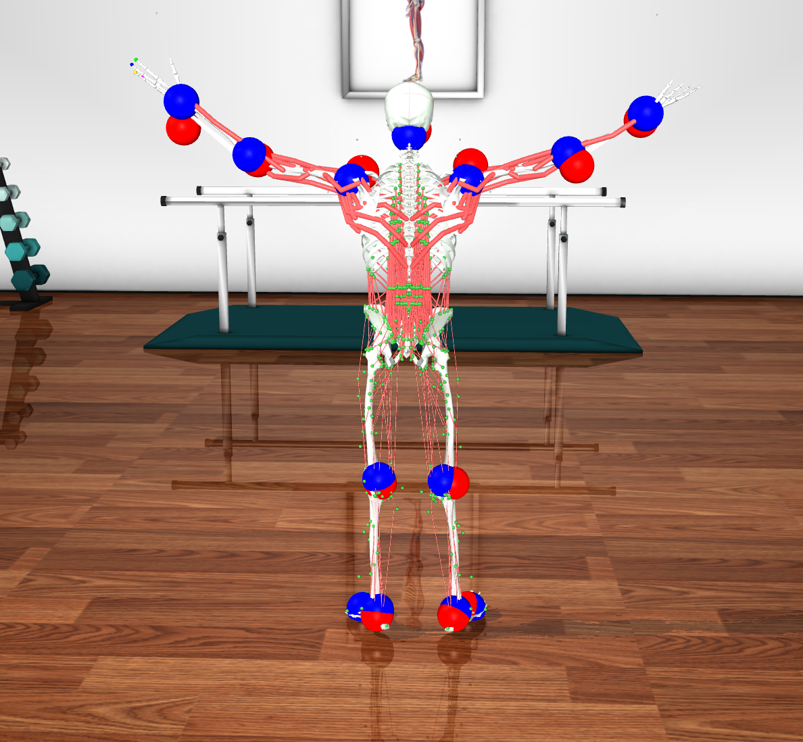

# MyoHuman — a full-body musculoskeletal environment for motion imitation

[](https://github.com/nikswir/Myohuman/actions/workflows/ci.yml)

MyoHuman is a **MuJoCo** simulation environment of a **whole-body human
musculoskeletal model** — **338 Hill-type muscles**, **45 bodies**,
**86 degrees of freedom** — actuated directly by **muscle activations** rather
than joint torques. It is built for **motion-imitation reinforcement
learning**: the agent must fire the muscles so that the body reproduces
reference human motions retargeted from motion capture.

Existing open musculoskeletal models cover only the legs and torso
(~290 muscles). MyoHuman extends coverage to **legs, torso *and* upper limbs**
(everything but the hands) in a single kinematic tree, so it can imitate a much
broader range of whole-body movement.

> **MyoHuman is the *environment*.** The neural-network policies that learn to
> control it — the muscle transformer, the training pipeline — live in a
> separate repository, **[MyoTrainer](https://github.com/nikswir/MyoTrainer)**.

<p align="center">
  
</p>

<p align="center"><em>The MyoHuman model in MuJoCo — 338 muscles (red) over the
full-body skeleton, with the 14 tracked points (blue = agent joints,
red = reference targets). An animated demo is coming soon.</em></p>

## The model

MyoHuman is assembled in MJCF (MuJoCo XML) by merging the separate anatomical
parts shipped with [MyoSuite](https://github.com/MyoHub/myosuite) — MyoLeg
(lower limbs), the spine/torso, and the arms — into one hierarchical body,
rooted at a **free joint** (6 DoF of global motion). Two simplifications keep
the model focused on whole-body locomotion and posture:

- **hands are removed** — no manipulation or fine motor tasks;
- **neck and head are fixed** to the thorax.

The result: **45 bodies**, **81 joints (86 DoF)** and **338 muscles**, each with
per-joint anatomical range limits.

| Region | Muscles | Examples |
| ------ | ------: | -------- |
| Torso / spine | 210 | psoas, iliocostalis, longissimus, multifidus, obliques |
| Legs | 80 | glutes, hamstrings, quadriceps, adductors, calf, foot |
| Arms | 48 | deltoids, rotator cuff, pectoralis, latissimus, biceps, triceps |
| **Total** | **338** | Hill-type muscle-tendon units (MuJoCo, rigid tendon) |

## The task

Each episode plays a **reference motion clip** and the agent must track it.
Following [DeepMimic](https://arxiv.org/abs/1804.02717), the reward rewards
closeness to the reference and penalizes control effort:

$$
r_t = w_{\text{pos}}\, e^{-k_{\text{pos}} \sum_i \lVert p^i_t - \hat p^i_t\rVert^2}
    + w_{\text{vel}}\, e^{-k_{\text{vel}} \sum_i \lVert v^i_t - \hat v^i_t\rVert^2}
    - w_e\big(\lVert a_t\rVert_1 + \lVert a_t\rVert_2\big),
$$

over **14 tracked body points** (root, head, and both arms' and legs' three
points each). An episode **terminates** when any tracked point drifts more than
$0.15\,\text{m}$ from the reference. Defaults:
$w_{\text{pos}}=0.7,\ k_{\text{pos}}=200,\ w_{\text{vel}}=0.3,\ k_{\text{vel}}=5,\ w_e=0.002$.

<table>
  <tr>
    <td></td>
    <td></td>
    <td></td>
  </tr>
</table>

*MyoHuman tracking reference clips across poses — **blue** spheres are the
agent's own tracked joints, **red** spheres the reference targets they must
follow.*

**Observation** $o_t \in \mathbb{R}^{807}$, all in the root-local frame (so it
is invariant to global body pose):

| Group | Contents | Size |
| ----- | -------- | ---: |
| Proprioception | root height & tilt, per-body local positions / 6-D orientations / linear & angular velocities (45 bodies), foot contacts | 681 |
| Task | agent−reference position & velocity error and reference positions for the 14 tracked points | 126 |

**Action** $a_t \in [-1,1]^{338}$ — one normalized command per muscle, mapped by
the environment to physiological activations $[0,1]^{338}$ that drive the
Hill-type muscle model.

**Timing.** Control runs at **30 Hz**; the physics step is $1/150\,\text{s}$
with **5** sub-steps per control step.

## Motion data

Reference motions come from the **KIT** subset of
[AMASS](https://amass.is.tue.mpg.de/), filtered to standing whole-body clips
(walking, running, turning, squatting, bending, kicking, gesturing; clips that
rely on external objects/supports or non-standing starts are excluded).

Because AMASS is parameterized in **SMPL** while MuJoCo needs joint
coordinates, every frame is **retargeted by inverse kinematics** (per-frame
Levenberg–Marquardt with temporal regularization and joint-range limits) into
MyoHuman generalized coordinates $q \in \mathbb{R}^{87}$.

| Split | Clips | Duration |
| ----- | ----: | -------- |
| Train | 2 258 | ~6.0 h |
| Test | 565 | ~1.5 h |
| **Total** | **2 823** | **~7.5 h @ 30 Hz** |

That is ≈2.7× the reference data used by prior locomotion-only work.

## Quickstart

Requires **Git**, **[Git LFS](https://git-lfs.com/)** (for the packaged
SMPL/model assets) and **[uv](https://docs.astral.sh/uv/)** (installs
Python 3.12+ itself).

```bash
brew install git-lfs && git lfs install   # once per machine (macOS; apt on Linux)
git clone <repo-url> Myohuman
cd Myohuman
source install.sh                         # uv sync + environment setup
```

Launch the MuJoCo viewer on the model:

```bash
uv run python scripts/simulate.py --simulate 1              # full model
uv run python scripts/simulate.py --xml-path xml/myohuman_simpletorso.xml
```

The environment itself is a standard Gymnasium-style class:

```python
from myohuman.env.myohuman_im import MyoHumanIm   # obs/reward/termination as above
```

## Preparing the dataset from scratch

The packaged LFS data already contains processed motions. To rebuild them from
the raw sources:

1. Download **SMPL** (neutral) from <https://smpl.is.tue.mpg.de>, rename to
   `SMPL_NEUTRAL.pkl`, and place it in `data/smpl/`.
2. Download **KIT** (AMASS, SMPL-H):
   ```bash
   uv run python scripts/download_kit.py --data-dir data/
   ```
3. Run the first part of `notebooks/dataset.ipynb` (clip selection).
4. Solve inverse kinematics for both splits:
   ```bash
   OMP_NUM_THREADS=1 MKL_NUM_THREADS=1 OPENBLAS_NUM_THREADS=1 \
       uv run python scripts/compute_ik.py --split train --workers 9
   OMP_NUM_THREADS=1 MKL_NUM_THREADS=1 OPENBLAS_NUM_THREADS=1 \
       uv run python scripts/compute_ik.py --split test  --workers 9
   ```
5. Run the second part of `notebooks/dataset.ipynb` to finish processing.

## Repo layout

```text
src/myohuman/
├── env/          MyoHumanIm & friends: MuJoCo env, imitation task, reward, termination
├── smpl/         SMPL body model + forward kinematics for retargeting
├── poselib/      pose / skeleton utilities
└── utils/        shared helpers
cfg/              Hydra config (config.yaml, env/, run/, learning/)
xml/              MJCF model: myohuman.xml, myohuman_simpletorso.xml, meshes, assets, scene
scripts/          download_kit.py, compute_ik.py (IK retargeting), simulate.py (viewer)
notebooks/        dataset.ipynb — end-to-end data preparation
data/             SMPL model, motion clips, inverse-kinematics output (Git LFS)
tests/            characterization tests (+ stage-2 device gate)
tools/            pre-commit style checks
```

## How it relates to MyoTrainer

| | MyoHuman (this repo) | [MyoTrainer](https://github.com/nikswir/MyoTrainer) |
| --- | --- | --- |
| Role | the **environment** — body, task, data | the **trainer** — policies & algorithms |
| Provides | `MyoHumanIm`, MJCF model, retargeted motions | muscle transformer, PPO / OBC pipeline |
| Depends on | MuJoCo, MyoSuite, AMASS/SMPL | consumes MyoHuman as a submodule |

MyoTrainer imports MyoHuman as a Git submodule and drives it through
`MyoHumanWrapper`; training details (transformer architecture, LATTICE, the
three-stage OBC → PPO pipeline) live there.

## Background

MyoHuman builds on:

- **MuJoCo** — Todorov et al., *MuJoCo: A physics engine for model-based
  control*, 2012.
- **MyoSuite** — Caggiano et al., 2022 — the muscle models this environment
  merges.
- **SMPL** — Loper et al., 2015 — parametric body model behind the mocap data.
- **AMASS / KIT** — Mahmood et al., 2019; Plappert et al., 2016 — motion data.
- **Kinesis** — Simos et al., 2025,
  [arXiv:2503.14637](https://arxiv.org/abs/2503.14637) — locomotion imitation
  for a legs+torso musculoskeletal model.
- **Arnold** — Chiappa et al., *A Generalist Muscle Transformer Policy*, 2025,
  [arXiv:2508.18066](https://arxiv.org/abs/2508.18066) — the transformer policy
  MyoTrainer adapts.

## Development

The engineering workflow — toolchain (uv), the pre-commit gate, two-stage
tests, CI — is documented in [AGENTS.md](AGENTS.md).

```bash
uv run pre-commit run --all-files   # lint, format, types, style checks
uv run pytest                       # stage-1 (fast, CPU) tests
RUN_STAGE2=1 uv run pytest          # + device-parity tests
```
